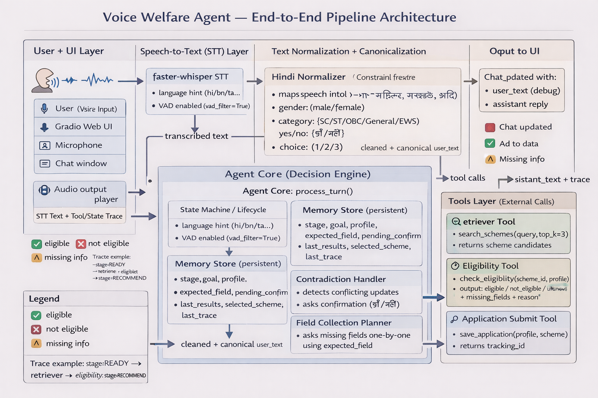
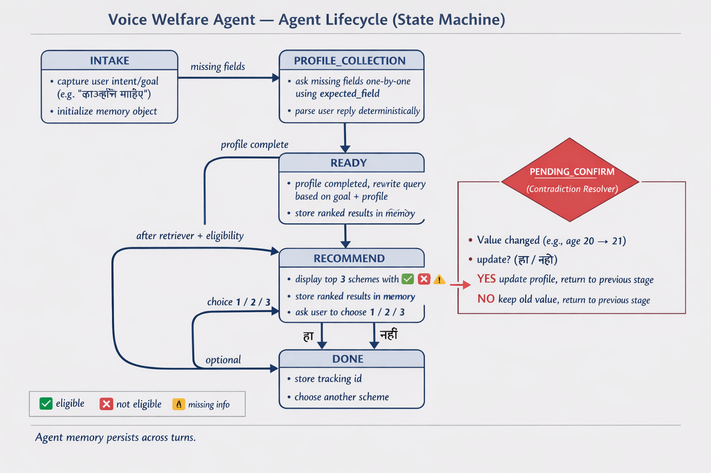
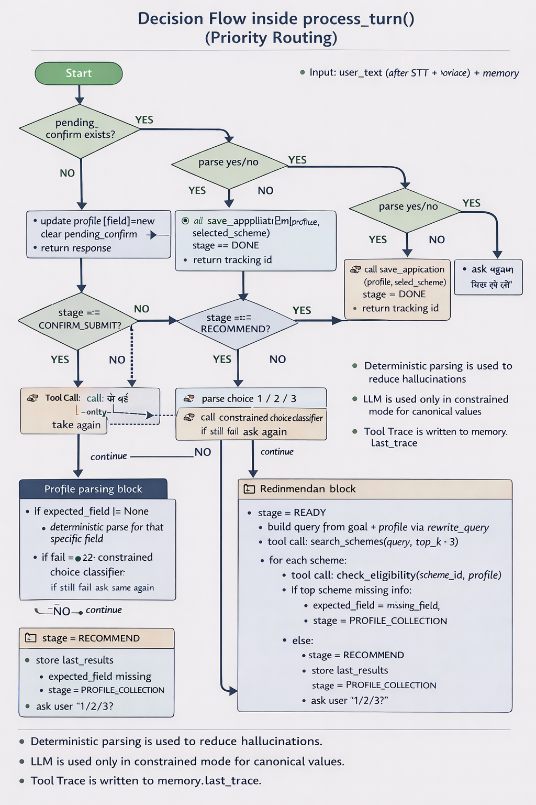
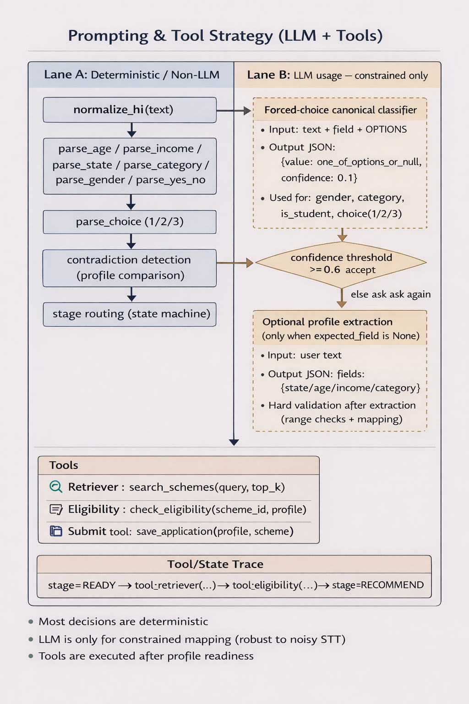

# Voice Welfare Agent (Hindi) 🇮🇳

**A Voice-First, Agentic AI Assistant for Government Welfare Schemes**

[](https://github.com/)
[](https://github.com/)
[](https://github.com/)

## 📖 Overview

The **Voice Welfare Agent** is a voice-first AI system designed to help users find and apply for government welfare schemes entirely through a native Indian language (Hindi).

Unlike simple chatbots, this system operates as an **autonomous agent** with a deterministic state machine. It listens to user queries, manages conversation memory across turns, actively detects contradictions in user inputs, and utilizes external tools to retrieve schemes, check eligibility rules, and simulate application submissions.

---

## Architecture



The Voice Welfare Agent is a voice-first Hindi AI system that helps users find and apply for government welfare schemes through a multi-step conversation. It goes beyond a chatbot by using an explicit state machine, tool calls, persistent memory, contradiction handling, and failure recovery.


### Agent Lifecycle (State Machine)


The agent follows these stages:
INTAKE → PROFILE_COLLECTION → READY → RECOMMEND → CONFIRM_SUBMIT → DONE
A special PENDING_CONFIRM state is triggered when the user gives contradictory info (e.g., age changes), and the agent asks confirmation before updating memory.


### Decision Routing (process_turn priority logic)


Each turn is routed with clear priority:
- If a pending confirmation exists → parse yes/no → update/keep old value → continue.
- Else route by current stage (e.g., parse choice 1/2/3 in RECOMMEND, parse yes/no in CONFIRM_SUBMIT).
- During profile collection, the agent uses expected_field to deterministically parse only the required field; if parsing fails it re-asks or uses a constrained fallback.

### Prompting + Tool Strategy (Deterministic-first)



Most logic is deterministic (normalization, parsing, routing, contradiction checks).
LLM usage is constrained (forced-choice canonical classifier) and accepted only above a confidence threshold; otherwise the agent asks again. Tools are executed after the profile is ready and results are stored for multi-step selection + submission.


### Memory (Persistent Across Turns)
The memory dictionary stores:
- stage, goal
- profile (state, age, income, category, optional gender/is_student)
- expected_field (prevents free-text drift)
- pending_confirm {field, old, new} (contradiction resolver)
- last_results, selected_scheme
- last_trace (tool/state trace for debugging)


## ✨ What this project does

**End-to-end pipeline:**
1. **Voice Input (Mic)** → Gradio UI
2. **STT (Speech-to-Text)** → `faster-whisper` transcribes Hindi audio
3. **Normalize + Canonicalize** → fixes common STT variations (Hindi)
4. **Agent Core (State Machine + Memory)** → decides next step
5. **Tools**
   - `search_schemes()` → retrieve top schemes
   - `check_eligibility()` → evaluate eligibility rules
   - `save_application()` → generate tracking ID
6. **TTS (Text-to-Speech)** → `gTTS` generates Hindi audio reply
7. **UI Output** → Chat + audio + debug trace

---

## ✅ Implemented Features 

### Voice + Multilingual UI
- Mic recording input via Gradio
- Hindi conversation end-to-end (STT → Agent → TTS)
- Dropdown for language selection (Hindi is the primary demo)

### Explicit Agent Lifecycle (State Machine)
Stages used:
- `INTAKE`
- `PROFILE_COLLECTION`
- `READY`
- `RECOMMEND`
- `CONFIRM_SUBMIT`
- `DONE`

### Memory Across Turns
Agent memory persists during session using `gr.State`, including:
- `stage`, `goal`, `profile`, `expected_field`
- `pending_confirm` (contradiction resolver)
- `last_results`, `selected_scheme`
- `last_trace` (Tool/State Trace for demo/debug)

### Contradiction Handling
If user changes a known value (e.g., age 20 → 21), agent asks:
- “क्या मैं अपडेट कर दूँ? (हाँ/नहीं)”
- YES → update profile
- NO → keep old value

### Tools (3 total)
- **Retriever tool:** `search_schemes(query, top_k=3)`
- **Eligibility tool:** `check_eligibility(scheme_id, profile)`
- **Submit tool:** `save_application(profile, scheme)` → returns `tracking_id`

### Failure Handling
- Empty audio / cleared mic → safely ignored
- STT returns empty text → asks user to speak again
- Unparseable answers for expected field → re-asks the same question
- Missing fields for eligibility → asks missing field before final recommendation

### Tool/State Trace (Debug)
UI shows a trace like:
- `stage=READY → tool=retriever(...) → tool=eligibility(...) → stage=RECOMMEND`

---

## 🧠 Agent Behavior Summary

### Profile collection (minimal required fields)
By default, the agent collects:
- `state`
- `age`
- `annual_income`
- `category` (SC/ST/OBC/General/EWS)

It may also ask **only when needed by eligibility rules**:
- `gender` (male/female)
- `is_student` (हाँ/नहीं)

### Recommendation flow
- Retrieves top 3 schemes
- Evaluates eligibility per scheme:
  - ✅ eligible
  - ❌ not eligible
  - ⚠️ unknown / missing info
- User selects scheme (1/2/3) → sees apply steps + documents
- User confirms submit (हाँ/नहीं) → tracking id is generated

---


## 🚀 Installation & Setup

### Prerequisites
* Python 3.9+
* FFmpeg (required for audio processing via faster-whisper)

### 1. Clone the repository
```bash```
git clone [https://github.com/raj208/voice-welfare-agent.git](https://github.com/raj208/voice-welfare-agent.git)
cd voice-welfare-agent


### 2. Create a Virtual Environment

#### Windows
```bash```
python -m venv .venv
.venv\Scripts\activate

#### macOS/Linux
```bash```
python3 -m venv .venv
source .venv/bin/activate


### 3. Install Dependencies
```bash```
pip install -r requirements.txt


### 4. Run the Application
```bash```
python app.py
